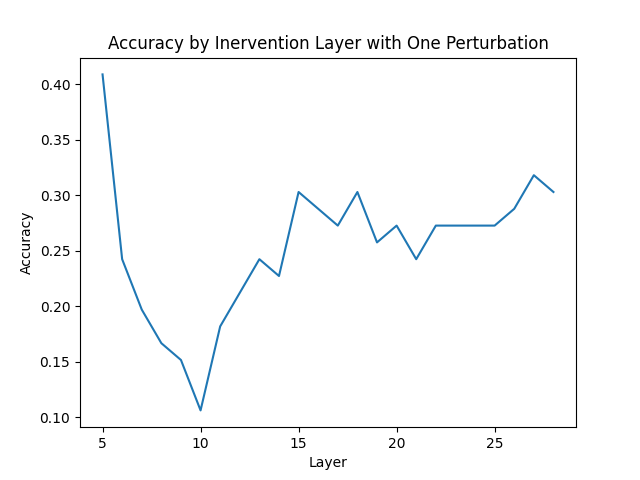

# Entity-wise Machine Unlearning via Activation Steering

**Training-free unlearning of specific facts from an LLM by ablating a single direction from its residual stream.**

Can you make a language model "forget" a targeted fact — without fine-tuning, gradient ascent, or retraining? This project applies **directional ablation** ("abliteration") to **entity-wise machine unlearning**: for a fact you want removed, it finds a single direction in the model's residual stream that encodes the *true* answer, and subtracts that direction at inference so the model can no longer produce it — while leaving unrelated behavior intact.

Built on `meta-llama/Meta-Llama-3-8B-Instruct` with [TransformerLens](https://github.com/TransformerLensOrg/TransformerLens). Independent NLP research (UW Allen School, Noah's Ark group).

---

## Method

For each fact (a question with a known answer), we build **contrastive prompt pairs** — the question completed with its *true* answer vs. with a *perturbed* (plausible-but-wrong) answer — and read the residual-stream activation at a chosen layer and token position.

1. **Forget direction.** Cache activations for the true-answer and perturbed-answer prompts, and take the (normalized) mean difference:

   $$d \;=\; \frac{\bar{a}_{\text{true}} - \bar{a}_{\text{perturbed}}}{\lVert \bar{a}_{\text{true}} - \bar{a}_{\text{perturbed}} \rVert}$$

   Intuitively, `d` points along "the model is about to say the true answer."

2. **Ablate it.** During greedy generation, project every layer's residual activation onto `d` and subtract it:

   $$a \;\leftarrow\; a - (a \cdot d)\,d$$

   The model is steered off the direction that produces the target fact — no weights are changed.

**Entity-wise** variant: group facts by *entity*, average one direction per entity over a few training questions, and test on held-out questions about the same entity — i.e. forget everything about an entity from a handful of examples.

<p align="center">
  
  <br>
  <em>Retained answer accuracy vs. the residual-stream layer at which the forget direction is ablated (TOFU world-facts). Forgetting is strongest around layer&nbsp;10 (retained accuracy ~10%), demonstrating the intervention is layer-steerable. Companion sweeps over intervention strength (α) and #perturbations live in <code>results/TOFU/world_facts/</code>.</em>
</p>

## Results

Evaluation measures **retained accuracy** — how often the model *still* produces the correct answer after the intervention (graded by an LLM judge, `utility_scripts/llm_eval.py`). **Lower is better**; the **forget rate = 1 − (post / baseline)**. Reproduce the table with `python analysis/summarize_results.py`.

| Setting (Meta-Llama-3-8B) | Retained: baseline → post-intervention | **Forget rate** |
|---|---|---|
| TOFU world-facts (TOFU-tuned model) | 100% → 9% | **91%** |
| topic-QA (fine-tuned) | 75% → 10% | **87%** |
| topic-QA (base instruct) | 95% → 27% | **72%** |
| TOFU world-facts (base instruct) | 72% → 23% | **67%** |
| synthetic-wikidata entities (all) | 91% → 65% | **29%** |

**Takeaways.** On memorized knowledge the intervention is strong — it removes up to ~90% of a fine-tuned model's target-fact accuracy — and its strength is controllable via the intervention layer and α. On broad, entity-averaged forgetting over many diverse facts (synthetic-wikidata) it is weaker and setting-sensitive: some configurations barely move retained accuracy, so results should be read per-setting, not as a single headline number.

> ⚠️ **On metric direction.** The committed `*-llm-accuracy.csv` files report **retained** accuracy, not forget rate. An earlier "93% accuracy" figure came from a `*-sampled` run whose retained accuracy (93%) was actually *above* its 91% baseline — i.e. that setting did **not** forget. The table above reports forget rate explicitly to avoid that confusion.

## Datasets

- **synthetic-wikidata** (`data/synthetic_wikidata/`): a purpose-built QA set — 789 questions over 23 entities, plus a "forget set" of sensitive/controversial entities × 10 property types. Each row has `entity, question, property, answer, perturbed_answer`. See its [readme](data/synthetic_wikidata/readme.md).
- **TOFU** (`locuslab/TOFU`): the standard fictitious-author unlearning benchmark (world-facts, real-authors, forget/retain splits).
- **topic_qa**, **PopQA** (`akariasai/PopQA`, popularity-ranked entity QA — see `results/PopQA/` for accuracy-vs-popularity plots).

## Repository layout

```
abliterate_entities.py    entity-wise unlearning (the headline method)
abliterate_tofu.py        TOFU benchmark (+ chat-template / ICL options)
abliterate_popqa.py       PopQA (per-question direction, popularity-ranked)
evaluate_finetune.py      fine-tune-to-forget comparison scaffold
src/                      shared model/eval helpers
utility_scripts/          llm_eval.py (LLM-judge), perturbation generation, plotting
analysis/                 summarize_results.py — forget-rate table from results
data/                     synthetic_wikidata, TOFU, topic_qa, PopQA
results/                  per-dataset accuracy CSVs + hyperparameter-sweep plots
run/                      shell scripts with the exact experiment commands
```

## Reproducing

Requires a **GPU** and access to gated **Meta-Llama-3-8B** weights (`HF_TOKEN`).

```bash
pip install -r requirements.txt          # Python 3.10
cp .env.example .env                      # set HF_TOKEN, OPENAI_API_KEY (judge/perturbations)

# Compute a per-entity forget direction and evaluate on held-out questions:
python abliterate_entities.py --results_file results/entities/topic_qa/intervention.csv \
    --layer 10 --num_train 4 --num_test 4

# Grade retained accuracy with the Llama-3 judge, then summarize forget rates:
python utility_scripts/llm_eval.py <results.csv>
python analysis/summarize_results.py
```
Exact commands per experiment are in `run/`.

## Limitations & next steps

This is a research prototype; honest caveats:

- **Collateral damage is not yet measured.** Only forgetting is quantified — there is no retain-set / general-capability (e.g. MMLU) evaluation of what *else* the ablation degrades. Reporting a retain/forget trade-off frontier is the top next step.
- **No baselines.** Not yet compared against Gradient Ascent / NPO (the standard TOFU baselines).
- **Judge is self-graded and unvalidated** against human labels; the older substring-match metric disagrees with it by up to ~10×.
- **Single model / single direction.** Multi-entity composition, robustness to paraphrase/ICL attacks, and cross-model transfer are open.

## License & references

MIT (see [`LICENSE`](LICENSE)). Method builds on directional-ablation / activation-steering work:

- Arditi et al., *Refusal in Language Models Is Mediated by a Single Direction* (2024).
- Maini et al., *TOFU: A Task of Fictitious Unlearning for LLMs* (2024).
